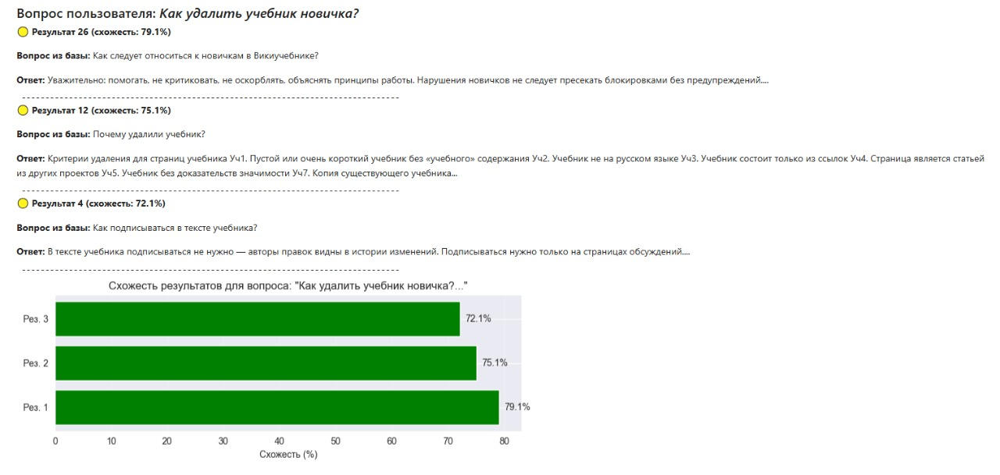
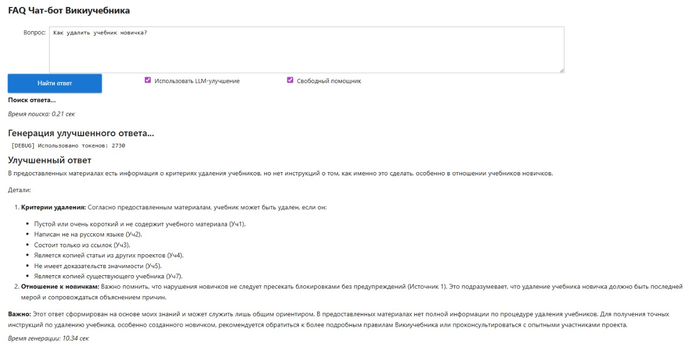
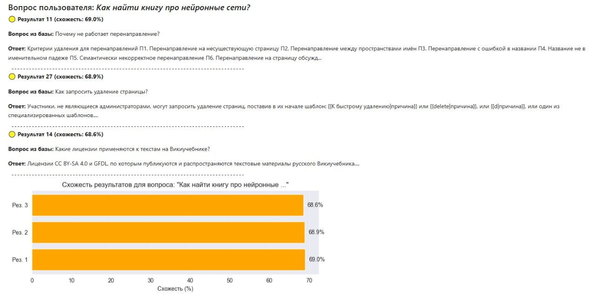
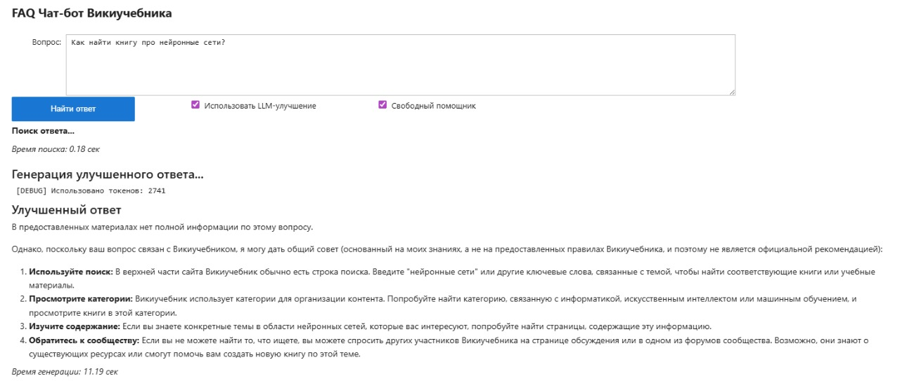

# FAQ Chatbot для Викиучебника: RAG-система на базе LLM

## Описание проекта
RAG (Retrieval-Augmented Generation) система для ответов на вопросы по правилам и политикам Викиучебника. Система использует локальную базу знаний (FAQ) и современные языковые модели для предоставления точных и контекстуально-релевантных ответов.

**Ключевая задача**: Создать прототип RAG-системы, способной работать как в строгом режиме (ответы только из базы знаний), так и в творческом (с использованием знаний LLM).

## Цели проекта
- Реализовать полноценный RAG-конвейер: от подготовки данных до генерации ответов
- Создать гибкую систему с двумя режимами работы (строгий/творческий)
- Обеспечить отказоустойчивость через fallback-механизмы

## Архитектура системы
```
Пользовательский вопрос
        ↓
[Embedding пользовательского вопроса]
        ↓
[Поиск похожих вопросов в базе] → Cosine Similarity
        ↓
[Сбор контекста] (топ-3 похожих вопроса)
        ↓
[Генерация ответа LLM] → [Fallback на лучший найденный ответ]
        ↓
Финальный ответ пользователю
```

**Компоненты системы:**
1. **Data Preparation** - расширение базы вопросов альтернативными формулировками
2. **Embedding Engine** - создание векторных представлений вопросов (Sentence Transformers)
3. **Similarity Search** - поиск по косинусной близости
4. **LLM Integration** - интеграция с OpenRouter API (Gemma 3 27B)
5. **Response Generation** - два режима генерации с разными промптами

## Технологический стек
- **Python 3.9+** - основной язык разработки
- **Pandas/Numpy** - обработка и анализ данных
- **Sentence Transformers** (all-MiniLM-L6-v2) - создание эмбеддингов и их сравнение
- **Scikit-learn** - вычисление косинусной близости (альтернативное сравнение эмбеддингов)
- **Matplotlib** - отображение графиков для демонстрации
- **OpenRouter API** - доступ к LLM (Gemma 3 27B)
- **Requests** - HTTP-запросы к API

##  Установка и запуск

### 1. Клонирование и установка зависимостей
```bash
git clone <repository-url>
cd <project-directory>
pip install -r requirements.txt
```

### 2. Подготовка данных
```bash
Загрузите ruwikibooks_rules.csv в папку data/
```

### 3. Настройка API ключа (опционально)
```bash
Для работы с LLM потребуется API ключ OpenRouter
Установите его в FAQ_WikiBooks_Chatbot.ipynb
```

### 4. Запуск системы
```bash
jupyter notebook FAQ_WikiBooks_Chatbot.ipynb
```
Запустите ячейки по порядку для:
- Установки зависимостей
- Подготовки данных
- Тестирования системы

## Примеры работы системы

**Вопрос частично совпадающий с данными в базе**



**Вопрос, ответа на который нет в базе**



### Вывод:
Основываясь на работе системы, можно сделать вывод, что семантический поиск улучшает результаты по сравнению с поиском по полному совпадению 
и позволяет отвечать на вопросы с общей сутью, но разными формулировками. Улучшения ответа с помощью LLM также помогает структурировать несколько возможных ответов 
и объединить их в один совет, который человеку комфортно читать. При менее строгом использовании LLM также можно добиться помощи с простыми вопросами, ответы на которые не представлены 
в базе, но это требует детальной настройки и строгого контроля, чтобы ответы были только по теме системы, а также не принесли вреда репутации компании или дискомфорта пользователю.

## Режимы работы ответов, улучшенных LLM:
1. **Строгий режим** - ответ строго по контексту из базы на основе подходящих ответов
Системный промт:
Ты — помощник-эксперт по правилам Викиучебника. 
        Твоя задача — на основе предоставленного контекста из официальной базы знаний дать точный, структурированный и полезный ответ.

        ИНСТРУКЦИИ:
        1. Используй ТОЛЬКО информацию из предоставленного контекста.
        2. Не выдумывай и не добавляй факты, которых нет в контексте.
        3. Если в контексте нет полного ответа на вопрос, честно скажи: "В предоставленных материалах нет полной информации по этому вопросу."
        4. Структурируй ответ: краткий вывод, затем детали по пунктам.
        5. Сохраняй официальный, но понятный стиль.
2. **Творческий режим** - LLM может дополнить ответ своими знаниями, если ответа нет в базе
Системный промт:
Ты — помощник-эксперт по правилам Викиучебника. 
        Твоя задача — на основе предоставленного контекста из официальной базы знаний дать точный, структурированный и полезный ответ.

        ИНСТРУКЦИИ:
        1. Используй ТОЛЬКО информацию из предоставленного контекста, если контекст дает ответ на предоставленный вопрос.
        2. Если в контексте нет полного ответа на вопрос, честно скажи: "В предоставленных материалах нет полной информации по этому вопросу."
        4. Если в контексте нет никакой подходящей для ответа информации, но вопрос связан с Викиучебником, дай пользователю общий совет для такого случая. 
        Обязательно укажи, что этот ответ создан на основе твоих знаний, а не заданных правил Викиучебника и может быть использован только как направление для дальнейших действий, а не официальная рекомендация.
        5. Структурируй ответ: краткий вывод, затем детали по пунктам.
        6. Сохраняй официальный, но понятный стиль.
3. **Fallback режим** - при недоступности LLM возвращает наиболее подходящий найденный ответ из базы